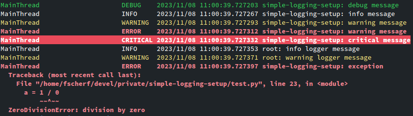

# simple-logging-setup


simple-logging-setup is a simple yet highly configurable library that provides
sane configuration defaults for the logging system in the Python
standard library.



**Features:**
 - No external dependencies
 - Simple coloring and detection if the terminal supports colored output
 - Formatting for exceptions
 - Support for [syslog severity levels](https://en.wikipedia.org/wiki/Syslog)
 - Log filtering
 - Easy to integrate into command line options


## Installation

simple-logging-setup can be installed using pip

```
pip install simple-logging-setup
```


## Usage

### Simple Setup
```python
import logging

from simple_logging_setup import setup

logger = logging.getLogger('my-logger')


setup(
    level='info',
    # put your configuration here
) 

logger.info('Hi mom!')
```


### Setup using command line options

```python
import argparse

from simple_logging_setup import setup


# parse command line
parser = argparse.ArgumentParser()

parser.add_argument(
    '-l',
    '--log-level',
    choices=['debug', 'info', 'warn', 'error', 'critical'],
    default='info',
)

parser.add_argument(
    '--loggers',
    type=str,
    nargs='+',
)

parser.add_argument(
    '--show-timestamps',
    action='store_true',
)

args = parser.parse_args()

# setup logging
setup(
    level=args.log_level,
    loggers=args.loggers,
    show_timestamp=args.show_timestamps,
)
```

    $ my-tool -l debug --loggers my-logger -disabled-logger
    $ my-tool --show-timestamps


## Configuration

All configuration is done by adding keyword arguments to
`simple_logging_setup.setup`.


| Name | Type | Description |
| --- | --- | --- |
| `level` | `str` | Log level. Choices (case insensitive): `['debug', 'info', 'warn', 'warning', 'error', 'critical']`
| `colors` | `switch` | Enables or disables colors. Gets disabled by default if the terminal does not support colored output |
| `syslog_priorities` | `switch` | Enables or disables [syslog severity levels](https://en.wikipedia.org/wiki/Syslog). Gets enabled by default if running in journald |
| `show_thread_name` | `switch` | Show thread name in log output |
| `show_level_name` | `switch` | Show log level name in log output. Gets enabled by default if colors are disabled or not available |
| `show_timestamp` | `switch` | Show timestamp in log output |
| `show_logger_name` | `switch` | Show logger name in log output |


`switch` is a special type that does best-effort parsing of incoming values.

Examples: `True`, `1`, `'True'`, `'TRUE'`, `'yes'`, `'on'`, [...]


## Filtering

Especially when the log level is set to `debug`, logging output can become hard
to read. simple-logging-setup allows you to filter loggers by including or
excluding specific logger names.

```python
from simple_logging_setup import setup

setup(
    loggers=[

        # include loggers to the output (the `+` is optional)
        'my-project.logger-1',
        '+my-project.logger-1',

        # exclude loggers from the output (both `-` and `_` can be used)
        '-my-project.logger-1',
        '_my-project.logger-1',
    ],
)
```

Why two prefixes to choose for excludes? The `-` notation makes more sense in
code but may not be suitable for command line options. This optional extra
notation allows for command line options like

  `--loggers +included-logger _excluded-logger`.


## Name Filtering

In some cases, it is not useful to always print all logger names. For example,
when creating a command line tool, a logger name like `my-project.my-sub-system`
is worth printing, but `root` is not. simple-logging-setup allows you to filter
out logger names, without excluding the logger entirely.

```python
from simple_logging_setup import setup

setup(
    filter_logger_names=['root'],
)
```


## Presets

simple-logging-setup comes with a list of useful presets which can be enabled
via the `preset` keyword argument.

```python
from simple_logging_setup import setup

setup(preset='service')  # 'service' is the default
```

| Name | Description |
| --- | --- |
| `service` | Enables all switches and features available |
| `cli` | Disables all switches but `show_logger_name` and filters the logger name `root` |
